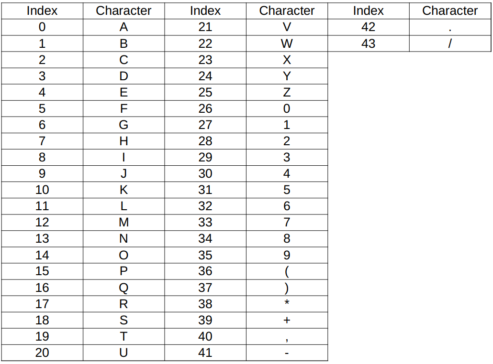

# LoginApplicationDXC

Login App for DXC technical challenge:
To create a login app with logout functionality along with interfaces for authenticated persons (registered users), as well as additional interface for authenticated persons with elevated privileges (admins).
Encoder from additional challenge has also been integrated into this app!

## Features

### Unauthenticated users

Non-logged in users (Public users) are able to access endpoints, via the app, to login to their accounts or to register a new one

### Authenticated users

Authenticated users are able to view their profile, which contains their username, name and their role. Authenticated users can also make use of the encoder to encode or decode phrases

#### Encoder logic



Offset character will be used and referencing its index, shift the table backwards (e.g. if F is the offset character, table is shifted back 5 indices and A would now be +).
This is applied to all characters in the phrase and the offset character is appended to the front of the resultant phrase.

### Admin users

Admin users will have a special toggle that only they can use to switch their view to a list of all users registered in the system, with everyone's names, usernames and roles.

# How to use

1. Install the packages specified in package.json `npm i`.
2. Setup front-end .env file with the following:

```
VITE_SERVER="Back-end-url"
```

3. With Maven and Java 17 installed, retrieve the Spring Boot back-end
4. Setup application.properties file with the following:

```
spring.datasource.url=jdbc:postgresql:
spring.datasource.username=
spring.datasource.password=
spring.datasource.driver-class-name=org.postgresql.Driver
spring.jpa.hibernate.ddl-auto=update

# JWT Secret Key
app.jwt.secret=
```

5. Run the LoginappApplication
6. Create tables via the .sql file included in the repo.

# Technologies used

## Front-end

### React.js

Front end was implemented in JavaScript, utilizing the React.js framework to construct components that comprise the web page. Instead of routing, pages were conditionally rendered due to the small scale of the app.

## Back-end

### Java 17

App was developed using Java Standard Edition Development Kit 17.

### SpringBoot 3.1.4 with SpringSecurity

SpringBoot framework was leveraged to generate RESTful endpoints and Spring Security 6 was used to authenticate requests, ensuring protected endpoints were only accessed by those with the right authorities.

## Database

### PostgreSQL

PostgreSQL was used to store User data and keep track of logins.

# General Approach

As this app was created in response to a technical challenge issued by DXC and the challenge was intended to gauge my Java programming prowess, I focused heavily on the back-end as that was where I expected to utilize Java the most. After a weekend of research, I began work constructing the services and REST controllers required, followed by configuring Spring Security to authenticate requests to the back-end. After several days of troubleshooting the back-end, I was able send requests and receive proper responses via Postman, which led me to progress to implementing a simple front-end in React.js. The Encoder challenge was completed at the very end after the entire app was usable.

# Challenges

Many SpringBoot and Spring Security libraries were too new; documentation was sparse and some bugs prevented me from accomplishing my goals. For example, the JJWT v0.12 library had a bug with its HS256 algorithm that prevented signing of JWTs (Now fixed as of writing!). Additionally, large changes in how Spring Security worked led to many guides on its usage becoming disastrously outdated, with most guides utilizing deprecated methods that could not serve my app's function.

# Solutions

After much experimentation, I managed to cobble this app together, compromising where I needed to. Such as Spring Security 6 having deprecated the cors() method, which led me to abuse the @CrossOrigin annotation and permiting all HTTP Options requests in order to circumvent CORS errors as I did not have the requisite knowledge to work around the problem. Or reverting to a slightly older version of JJWT which did not have the bug in order to generate JWTs proper.
